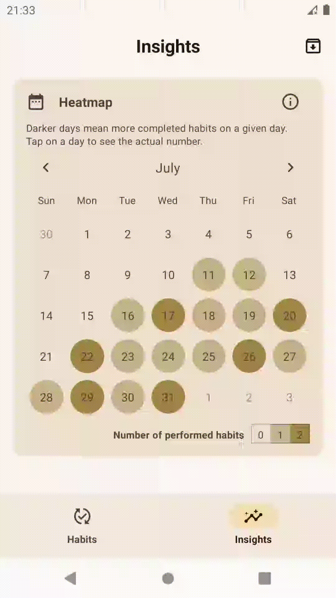
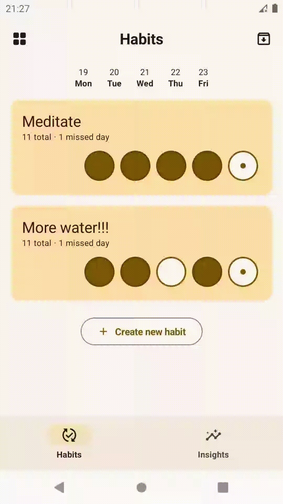

## Shukan 

**Shukan** is a minimalist habit tracker built using *Kotlin* with *Jetpack Compose* and [*Room*](https://developer.android.com/training/data-storage/room). 

[**Check out the Demo**](https://youtube.com/shorts/aelC1dwhY8w?si=eMR0qW0WubXL5OYe) 🌱

| **Streak Tracking 📈**                                                     | **Heatmap 📊**                                                             | **Mini Calendar 📅**                                                             |
|----------------------------------------------------------------------------|----------------------------------------------------------------------------|----------------------------------------------------------------------------------|
| Easily track and maintain your habit streaks.                              | Visualize your progress with a heatmap.                                    | Quickly view your habits with a mini calendar.                                   |
| 

 | 

 | 

 |

#### Requirements:
- **AGP 8.5.0**
- **Java 17**
